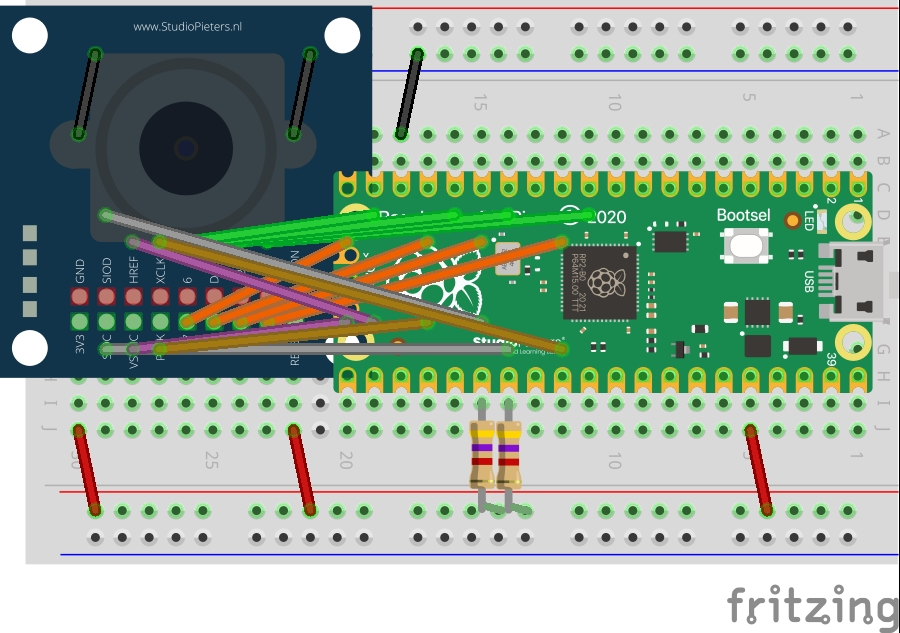
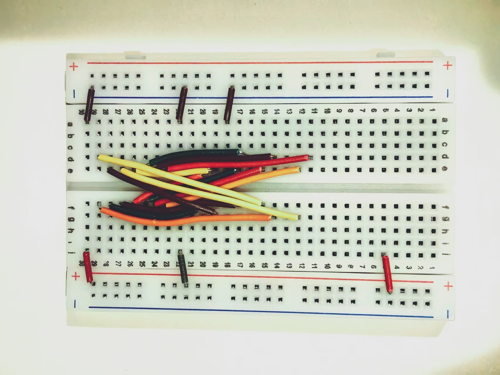
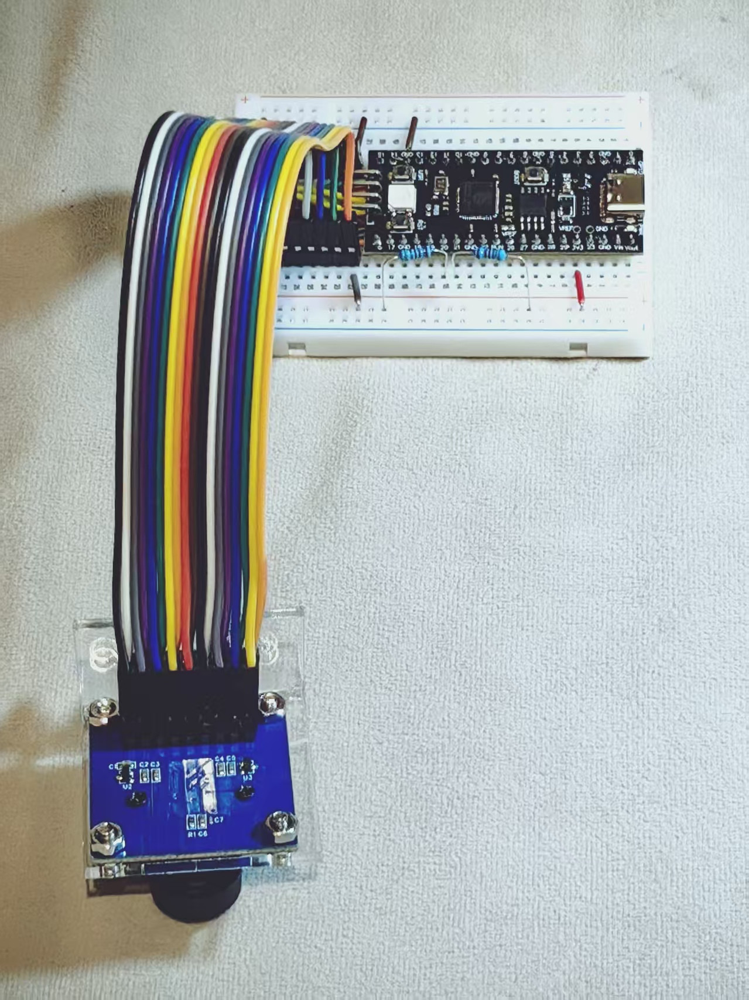

# OV7670 摄像头 → RP2040 USB 实时视频流 (UVC)

YD-RP2040 无 FIFO OV7670 摄像头采集，通过原生 USB 输出**标准 UVC 视频流**（免驱动摄像头）。
固件用 PIO 采集 + DMA 搬运，TinyUSB 视频类把 Pico 枚举成标准 UVC 摄像头（YUY2 320×240），
macOS / Windows / Linux 直接识别，无需任何自定义协议。

## 特性

- **无 FIFO 直采**：PIO0 SM1 按 PCLK/HREF 采样 8-bit 像素总线，VSYNC 上升沿触发 DMA 整帧搬运
- **UVC 免驱动输出**：TinyUSB 视频类（`tud_video_n_frame_xfer`）把帧以 YUY2 格式送出，主机识别为 `YD RP2040` 摄像头
- **零转换**：OV7670 配置为 YUV422 YUYV 输出（COM7=0x10、COM15=0xC0、COM13=0x80），与 UVC YUY2 字节序 1:1 匹配，MCU 不做像素转换
- **实时查看器**：`live_view_uvc.py`（ffmpeg 按设备名抓流 + OpenCV 显示，支持缩放/向左旋转 90°/S 键存 BMP）
- **板载诊断**：`'R'` 寄存器回读、`'W'/'S'` 波形采样、`'B'` 软重启进 BOOTSEL（免按键刷固件）
- **性能**：QVGA 320×240，UVC 声明 1–10 FPS，默认 ~6 FPS（USB 全速 12 Mbps 是瓶颈）

## 硬件接线

| OV7670 | YD-RP2040 | 物理 Pin | 说明 |
|--------|-----------|----------|------|
| 3V3 | 3V3 | 36 | 3.3V，勿接 5V |
| GND | GND | 3/8/13… | 共地 |
| D0–D7 | GP8–GP15 | 11/12/14/15/16/18/19/20 | PIO IN bit0–7（`in_base=8`，避开 USB GP0/GP1） |
| PCLK | GP18 | 24 | PIO 输入，wait 边沿 |
| HREF | GP17 | 22 | PIO 输入，行门控 |
| VSYNC | GP16 | 21 | GPIO 输入，帧起止 |
| XCLK | GP22 | 29 | 硬件 PWM 20.83 MHz（125 MHz/6） |
| SIOC | GP21 | 27 | 硬件 I2C0 SCL ~10 kHz，+4.7k 上拉 |
| SIOD | GP20 | 26 | 硬件 I2C0 SDA ~10 kHz，+4.7k 上拉 |
| RESET | 3V3 | 36 | 常高 |
| PWDN | GND | — | 低电平 = 工作 |

完整表格见 `pinout.csv`（其中 XCLK 频率以本文为准：125/6 = **20.83 MHz**，低于 24 MHz 规格）。

## 接线图与实物

**理论接线图**（Fritzing 面包板图）：



原始可编辑工程文件：[ov7670_rp2040.fzz](ov7670_rp2040.fzz)（用 Fritzing 打开，可改线再导出）。

**实际接线照片**：



**成品实物图**：



## 工作原理

```
OV7670 ──8-bit D[0:7]──▶ PIO0 SM1 ──▶ DMA ──▶ frames[153600]
          PCLK/HREF       (像素采样)        (单缓冲)      │
VSYNC ──▶ GPIO IRQ ──▶ 触发 DMA ────────────────────────┘
                                                       ▼
                          TinyUSB UVC 视频类 (YUY2)
                                                       ▼
                      USB 枚举为 "YD RP2040" 摄像头
                                                       ▼
              主机端 ffmpeg 按设备名抓流 → live_view_uvc.py
```

1. **XCLK**：GP22 硬件 PWM 20.83 MHz（`-DXCLK_PWM`，另支持 PIO 8.3 MHz 默认档）
2. **采集**：PIO0 SM1 在 PCLK 边沿采样 GP8–GP15，HREF 高电平期间收像素字节
3. **DMA**：VSYNC 上升沿 IRQ 重新配置并触发 DMA，整帧搬入 `frames[]`（153,600 B = 320×240×2）
4. **传输**：DMA 完成后置 `frame_ready`，`loop()` 经 `tud_video_n_frame_xfer` 非阻塞交给 TinyUSB。
   一次只允许一个 UVC 传输在途（`uvc_tx_busy`），完成后由
   `tud_video_frame_xfer_complete_cb` 清标志并允许 DMA 重新武装（这就是 ~6 FPS 的瓶颈来源）

## 帧协议（UVC）

**无自定义协议**——视频流是标准 USB Video Class（UVC）YUY2：

```
每帧 = UVC payload（YUY2 320×240 = 153,600 字节，与 OV7670 YUYV 输出 1:1）
```

- **格式**：YUY2（YUV 4:2:2），`guidFormat = TUD_VIDEO_GUID_YUY2`，16 bpp
- **分辨率**：320×240（`FRAME_W × FRAME_H`），bitrate 1–10 FPS 连续区间
- **默认帧率**：~6 FPS（`dwDefaultFrameInterval = 1666667 ns`，USB 全速 iso 上限）
- **帧率区间**：最小间隔 1 ms（10 FPS）~ 最大间隔 10 ms（1 FPS）
- **颜色**：BT.709 色彩原色/传输特性、SMPTE 170M 矩阵系数
- **诊断数据**：CDC Serial 仅发 `DBG1` magic 前缀的诊断字节，与 UVC 视频流隔离

> 旧 CDC 固件（`main` 分支）的 "CAM1" 协议见文末"旧版（CDC）固件"。

## 构建与烧录

依赖：PlatformIO Core（平台 `maxgerhardt/platform-raspberrypi.git`，框架 `arduino` = arduino-pico）。

```bash
# 编译（QVGA 320×240）
pio run

# 烧录（自动探测端口；板子死机时先按住 BOOTSEL 上电，或先发 'B'）
pio run -t upload

# 串口监视（诊断命令用）
pio device monitor -b 115200
```

分辨率与时钟在 `platformio.ini` 的 `build_flags` 里调：

```ini
-DUSE_TINYUSB=1                ; 启用 TinyUSB UVC 视频类（当前固件）
-DFRAME_W=320 -DFRAME_H=240   ; 帧尺寸（UVC 描述符同步生成）
-DXCLK_PWM                    ; XCLK 走硬件 PWM 20.83 MHz
```

> 注意：改分辨率需同步 `ov7670.c` 的缩放寄存器（当前 init 表为 QVGA 值）。

## 主机端用法

Python 依赖：`opencv-python` + `numpy`（live_view_uvc.py）+ 系统 `ffmpeg`
（macOS AVFoundation 后端按索引打不开 UVC 设备，必须按**设备名**打开）。

### UVC 实时查看（当前固件）

```bash
# 1) 列出 UVC 设备（按名字匹配，不按索引——枚举顺序可能变化）
python3 live_view_uvc.py --list
#   输出示例：
#   [0] YD RP2040
#   [1] FaceTime高清相机 (内建)

# 2) 实时查看（默认 2 倍放大 + 向左旋转 90°；S 存 BMP，Q/Esc 退出）
python3 live_view_uvc.py

# 3) 常用参数
python3 live_view_uvc.py --rotate 0      # 不旋转
python3 live_view_uvc.py --rotate 270    # 向右旋转 90°
python3 live_view_uvc.py 1               # 1 倍缩放
python3 live_view_uvc.py --width 320 --height 240 --fps 10   # 显式分辨率/帧率
```

- 设备自动匹配：优先含 `RP2040` 的名字 → 其次 USB camera → 最后任意非 FaceTime/屏幕设备
- ffmpeg 未安装时脚本报错；可把 `FFMPEG_CANDIDATES` 改为你的 ffmpeg 路径
- UVC 描述符声明最高 10 FPS；实际吞吐受 USB 全速 iso 限制（见性能）

### 旧 CDC 固件（`main` 分支）工具

```bash
python3 capture.py [port] [outdir] [nframes]   # 单帧捕获 → BMP
python3 live_view.py [port] [scale] [rotate]   # 实时查看（pygame）
python3 verify_frame.py frames/capture/camera_frame_*.bmp  # 帧校验
```

> `live_view.py` / `capture.py` / `verify_frame.py` 仅适用于旧 CDC CAM1 固件（`main` 分支），
> 与当前 UVC 固件（`feat/ov7670-uvc`）不兼容，保留供参考。

## 诊断命令（串口发送单字符）

| 命令 | 功能 |
|------|------|
| `W` | 快速波形采样（GPIO 直读，不干扰采集流水线） |
| `S` | 慢速波形采样 |
| `R` | 寄存器回读：验证 init 写入 + 实时 AGC/AEC 状态（`DBG1` 包） |
| `B` | 软重启进 BOOTSEL（U 盘模式拖放刷固件） |

板子无响应（主机看不到摄像头、`R` 无 `DBG1` 回复）时先重新上电。

## 性能与已知限制

- **~6 FPS @ QVGA（UVC 默认）**：瓶颈是 USB 全速 iso 吞吐（~1 MB/s 上限），不是采集。
  UVC 描述符声明 1–10 FPS 连续区间，默认 1666667 ns ≈ 6 FPS。
- **单缓冲不可双缓冲**：2 × 153,600 = 300 KB 超过 RP2040 264 KB SRAM（`main.cpp` 已注明），
  因此采集与传输串行，`uvc_tx_busy` 门控丢帧。
- **降分辨率**：改 `FRAME_W/H = 160/120` + `ov7670.c` 缩放寄存器可提帧率，但画面变糊
  （OV7670 硬件整数倍缩放，非高质量插值）。
- **画面旋转/噪点**：OV7670 无 IR filter 画面偏红；传感器安装方向决定画面需向左旋转 90°
  （`live_view_uvc.py` 默认已处理，`--rotate 0` 可关）。
- **macOS 设备枚举**：UVC 设备顺序可能变化，务必用 `--list` 按设备名匹配而非索引。

## 目录结构

```
├── platformio.ini          # 构建配置（build_flags：USE_TINYUSB/分辨率/XCLK）
├── pinout.csv              # 接线表
├── .gitignore              # 忽略构建输出（.pio/）、生成帧（frames/）等
├── ov7670_rp2040_bb.jpg    # 理论接线图（Fritzing 面包板图）
├── ov7670_rp2040.fzz       # Fritzing 原始工程文件（可编辑）
├── wiring_diagram_photo.jpg # 实际接线照片
├── real_product.jpg        # 成品实物图
├── live_view_uvc.py        # UVC 实时查看器（ffmpeg + OpenCV，当前固件）
├── capture.py              # 旧 CDC 固件：单帧捕获 → BMP
├── live_view.py            # 旧 CDC 固件：实时查看器（numpy + pygame）
├── verify_frame.py         # 帧数据校验工具（旧 CDC 固件）
├── docs/
│   └── OV7670_RP2040_REFERENCE.md
├── include/                # 头文件目录（PlatformIO 模板）
├── lib/                    # 私有库目录（PlatformIO 模板）
├── test/                   # 测试目录（PlatformIO 模板）
└── src/
    ├── main.cpp            # 主逻辑：PIO 采集 + DMA + TinyUSB UVC 流 + 诊断
    ├── camera.pio          # PIO 程序（XCLK + 捕获）
    ├── camera.pio.h        # pioasm 生成的头文件
    ├── ov7670.c/.h         # OV7670 驱动（SCCB over 硬件 I2C0）
```

## 旧版（CDC）固件

`main` 分支的旧固件通过 USB CDC 串口发送自定义 "CAM1" 帧：

```
"CAM1" (4 B) | W (u16 BE) | H (u16 BE) | W×H×2 字节原始 RGB565
```

- **W/H 为大端**（`capture.py` 用 `struct.unpack('>HH')` 解析）
- **像素为大端**：OV7670 先出高字节，PIO 保持字节序。主机解析必须用
  `(b[i] << 8) | b[i+1]`；用小端 `b[i] | b[i+1] << 8` 会交换 R/B 并打乱 G。
- 诊断包用独立的 `"DBG1"` 魔数，`capture.py` 的帧同步循环直接放行，不会误匹配。
- 性能：QVGA @ ~4.2 FPS（CDC 全速有效吞吐 ~660 KB/s）。

## 参考

- [docs/OV7670_RP2040_REFERENCE.md](docs/OV7670_RP2040_REFERENCE.md) — 技术参考（寄存器、时序、调试记录）
- OV7670 数据手册（SCCB / RGB565 / QVGA 寄存器表）
